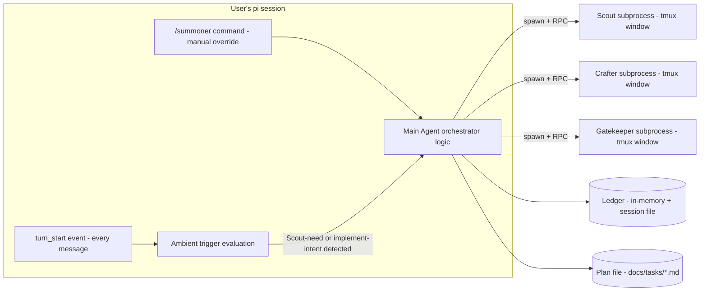

# /summoner — Architecture

> Replaces a BE/FE split — `/summoner` is a pi.dev extension, not a client/server app. There's no HTTP boundary, no database, no separate frontend; everything below is one process tree (Main Agent's own pi process + the subprocesses it spawns) talking over stdin/stdout RPC and tmux. This doc covers the same ground a BE doc would (folder structure, libs, core modules) adapted to that shape.

## Runtime model

`/summoner` runs *inside* the user's existing pi session as a normal extension. In v3, it's no longer purely command-triggered — it hooks `pi.on("turn_start", ...)` (or the nearest equivalent per-turn lifecycle event) to evaluate every conversation turn against the two ambient triggers (Scout-need, implement-intent), in addition to still registering `/summoner <task>` as a manual override via `pi.registerCommand`. Either path leads to the same place: the **Main Agent orchestrator**, which spawns and manages separate `pi --mode rpc` subprocesses, one per summoned sub-agent. Those subprocesses are real, independent pi sessions; Main Agent talks to them purely over RPC (JSONL stdin/stdout), and surfaces them to the user as tmux windows.



**A real risk worth flagging here, not glossing over**: evaluating ambient intent on every single turn means this evaluation logic runs constantly, on every message, including ones with nothing to do with `/summoner` at all. That's a meaningfully different performance/cost profile than a command that only runs when explicitly invoked — worth treating as a first-class design concern in Phase 1 (see Milestones), not an afterthought. A cheap, fast model for this specific classification step (separate from whichever model ends up doing the actual Scout/Crafter/Gatekeeper work) is probably the right call rather than running it through the user's primary model every turn.

## Folder structure

Following pi.dev's standard extension layout (`index.ts` entry point + helper modules):

```
~/.pi/agent/extensions/summoner/
├── index.ts              # Entry point - registers /summoner command AND turn_start hook
├── trigger.ts             # Ambient trigger evaluation: Scout-need + implement-intent detection
├── orchestrator.ts        # Main Agent loop: decide → plan → summon → loop
├── agents.ts              # Agent role definitions (Scout/Crafter/Gatekeeper) - model defaults, prompts
├── rpc-client.ts           # Wraps spawning + talking to a pi --mode rpc subprocess
├── tmux.ts                 # tmux window create/destroy/rename, /watch command logic
├── ledger.ts               # Ledger: in-memory store + read/write helpers
├── plan-file.ts            # Plan file read/write/checkbox-update/archive logic
├── incantation.ts          # Generates the varied summon flavor-text (chat-only)
├── status-widget.ts        # Renders the 🟢/🟡/✅ widget via ctx.ui.setWidget
└── types.ts                # Shared types: LedgerEntry, AgentInstance, Plan, etc.
```

Project-local override goes in `.pi/extensions/summoner/` with the same internal structure, per standard pi.dev convention.

## Core modules

### `rpc-client.ts` — subprocess wrapper

Wraps everything needed to spawn and drive one sub-agent subprocess. One instance of this per summoned agent.

- **Spawn**: `pi --mode rpc --no-session --model <provider/id:thinking>` via Node's `child_process.spawn`, run inside a tmux window (see `tmux.ts`) rather than detached, so it's watchable.
- **Send**: write JSONL commands to the subprocess's stdin (`prompt`, `get_state`, `set_model`, `abort`, etc.) per the RPC protocol.
- **Receive**: a JSONL line reader on stdout (matching the framing rules — split on `\n` only, since Node's `readline` is not protocol-compliant here) that demuxes `response` objects (correlated by `id`) from `event` streams.
- **Health check**: periodic `get_state` call with a timeout. On timeout/no-response, signal back to the orchestrator that this instance needs killing + resummoning.

### `trigger.ts` — ambient trigger evaluation

Runs on every `turn_start`. Two independent checks, evaluated separately (per PRD — needing Scout doesn't imply implement-intent, and vice versa):

```ts
interface TriggerResult {
  needsScout: boolean;        // "does Main Agent need codebase info right now"
  implementIntent: boolean;   // "is the user indicating intent to implement"
}

function evaluateTurn(turnContext: TurnContext): Promise<TriggerResult>;
```

- **`needsScout`**: deliberately has no positional restriction — checked on every turn regardless of what else is happening (mid-task, post-task, fresh topic, side-question). The check itself is "would answering this require codebase knowledge Main Agent doesn't already have," explicitly excluding doc lookups (README/PRD), which Main Agent handles itself.
- **`implementIntent`**: the narrower, heavier-weight check — "is the user asking for a fix/feature to actually be built," not just discussed. This is the one with real false-positive/negative risk (see Runtime model's cost note) and is the most likely candidate for prompt iteration once there's real usage to learn from.
- This module is intentionally the *only* place trigger logic lives — `orchestrator.ts` doesn't re-decide triggering, it just acts on `TriggerResult`.

### `orchestrator.ts` — the Main Agent loop

The actual control flow from `flow.md`, as code rather than diagram:

1. Triggered either by `trigger.ts`'s `TriggerResult` (ambient) or directly via `/summoner <task>` (manual override — skips straight to step 3/4 with `implementIntent` treated as true).
2. If `needsScout`: dispatch Scout directly, no approval gate, no timing restriction (can run concurrently with an in-flight Crafter/Gatekeeper).
3. If `implementIntent`: check `plan-file.ts` for an existing matching plan first. If found, load it. If not, build a new detailed action plan from Scout's findings (if any) and write it via `plan-file.ts`.
4. Present plan to user via `ctx.ui` → approval also sets trust mode for this plan.
5. For each step: summon the right agent (via `agents.ts` + `rpc-client.ts` + `incantation.ts`), wait for its report, update the Ledger and the plan file's checklist (via `plan-file.ts`), decide whether to re-summon Scout (blast-radius judgment call) or continue.
6. After all steps: always summon Gatekeeper. Route findings per the scope rule (out-of-scope → ask user; in-scope → dispatch Crafter to fix, then Gatekeeper re-checks).
7. Move the plan file to `archived/` via `plan-file.ts`. Report completion to the user.

This module owns the only mutable orchestration state — no sub-agent or Gatekeeper instance holds its own conflicting view of progress.

### `agents.ts` — role definitions

Each role (Scout, Crafter, Gatekeeper, and any user-defined ones) is registered through the same shape — no special-cased "core" agent, per the PRD's flat-and-equal principle:

```ts
interface AgentDefinition {
  name: string;
  systemPrompt: string;
  defaultModel: ModelRef;       // can be overridden per-summon
  defaultThinking: ThinkingLevel;
  tools: ToolName[];             // Gatekeeper's array deliberately excludes write/edit
  canDispatchWithoutApproval: boolean; // true for Scout, false for others
}
```

Gatekeeper's `tools` list is the architectural enforcement of "Gatekeeper never touches files" — it's not just a behavioral rule in the prompt, the subprocess physically has no write/edit tool available to it.

### `tmux.ts` — window orchestration

- `createWindow(name: string, command: string)` → `tmux new-window -n <name> <command>`
- `renameOnRespawn(baseName: string)` → checks existing windows, appends `-2`, `-3`, etc. if the base name's already taken (the increment-on-resummon rule)
- `watch(name: string)` → `tmux select-window -t <name>`, invoked by the `/watch` command handler
- `killWindow(name: string)` → used by the crash-recovery flow before resummoning

### `plan-file.ts` — plan checklist persistence

The one piece of disk-writing `orchestrator.ts` does directly (consistent with the PRD's rule: Main Agent only writes its own orchestration metadata, never project code, never substantial documentation).

```ts
interface PlanFile {
  path: string;              // docs/tasks/{timestamp}-{short-title}.md
  steps: { description: string; done: boolean }[];
}

function findExisting(taskDescription: string): Promise<PlanFile | null>;
function write(plan: PlanFile): Promise<void>;
function checkOffStep(path: string, stepIndex: number): Promise<void>;
function archive(path: string): Promise<void>;  // moves to docs/tasks/archived/
```

- **Location**: `docs/tasks/` (committed to git, not `.pi/tasks/` — decided to stay consistent with "git-portable" being a recurring value across other projects; plan history is genuinely useful project history, not just scratch state).
- **Filename**: `{timestamp}-{short-title}.md`, giving natural chronological ordering with `ls`.
- **`findExisting`** is what powers the "continuing from an existing plan" exception — a real file scan against `docs/tasks/`, not an inference from conversation.

### `ledger.ts` — single source of truth

Minimum viable shape per the PRD — no conflict-detection logic needed since execution is sequential-only in v1:

```ts
interface LedgerEntry {
  file: string;
  agent: string;       // which agent instance touched it
  action: "read" | "write" | "delete";
  timestamp: number;
}
```

- In-memory array for the duration of the `/summoner` run.
- Optionally persisted via `pi.appendEntry()` (session persistence API) so the Ledger survives if the user's main session is interrupted and resumed — worth confirming whether this is wanted for v1 or deferred.
- Only `orchestrator.ts` writes to it. Nothing else has write access — mirrors the "single source of truth" principle from the PRD.

### `incantation.ts` — flavor text generation

Pure function, no side effects: given an `AgentDefinition`, the chosen model, thinking level, and a reason string, returns one of several phrased variants (summon-with / fuel-of / bestow, per the PRD) at random or by simple rotation. Called by `orchestrator.ts` right before `rpc-client.ts` actually spawns the subprocess — never after.

### `status-widget.ts`

Renders the running `🟢/🟡/✅` list via `ctx.ui.setWidget("summoner", [...lines])`, called whenever an agent's status changes (spawned, working, done, failed). Lives in tmux window 0 alongside Main Agent's own conversation, per `flow.md`.

## Key libraries / APIs relied on

- `@earendil-works/pi-coding-agent` — `ExtensionAPI` (`registerCommand`, `ctx.ui.*`, `pi.appendEntry`)
- Node built-ins: `child_process` (spawn), `node:readline`-equivalent custom line splitter (NOT `readline` itself, per the RPC framing caveat)
- `tmux` CLI, shelled out to directly — no npm wrapper needed, the command surface is small (`new-window`, `select-window`, `kill-window`)

## Open questions

- Should the Ledger persist across multiple summon-loop runs within the same pi session (via `pi.appendEntry`), or reset fresh each time a new plan starts? Leaning toward fresh-per-plan for v1 simplicity, but not yet decided.
- Exact polling interval for subprocess health checks (`get_state` timeout) — not yet specified, needs a sensible default (e.g. no response within N seconds = treat as hung).
- Exact lifecycle event name for "evaluate every turn" — `turn_start` is the best candidate based on current docs, but should be confirmed against the live `ExtensionAPI` event list before implementation, since this is a new (v3) dependency that v2 didn't have.
- What model/cost profile runs `trigger.ts`'s per-turn evaluation — needs to be cheap enough to run on every message without meaningfully slowing down normal conversation (see Runtime model's cost note).