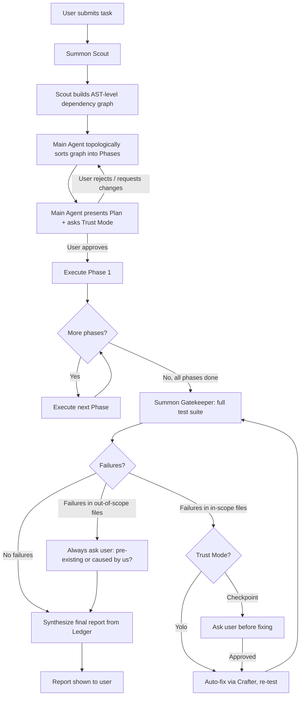
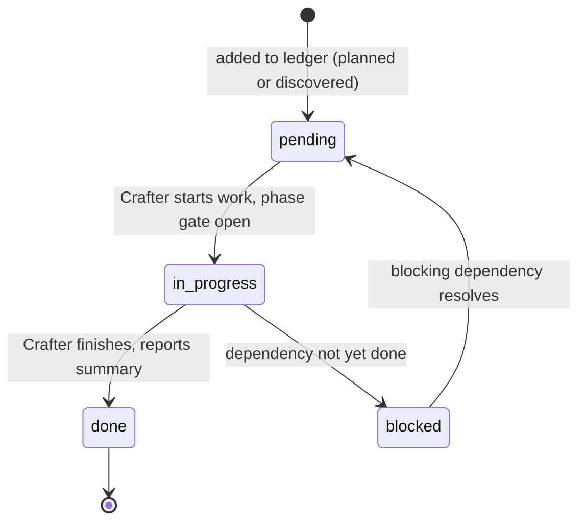
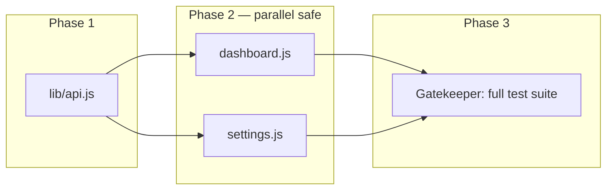
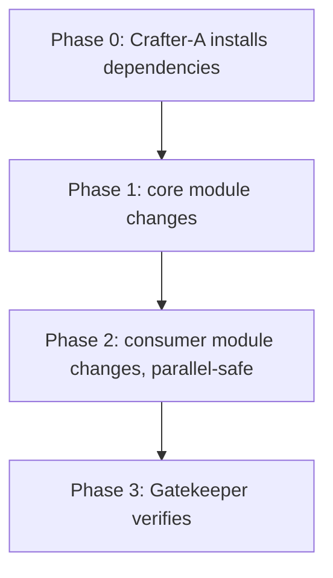
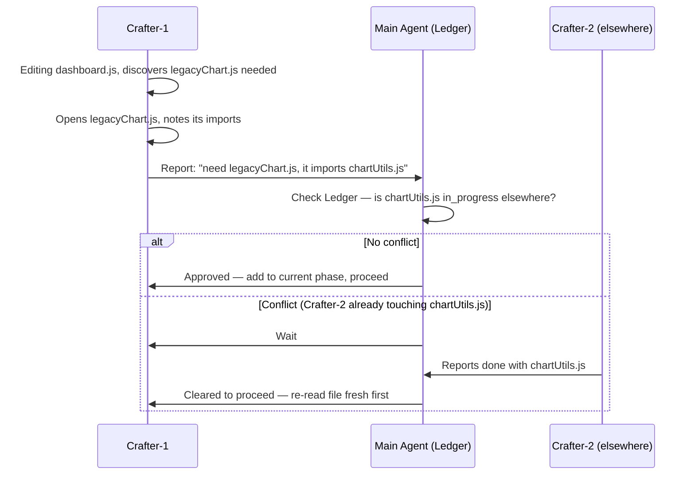
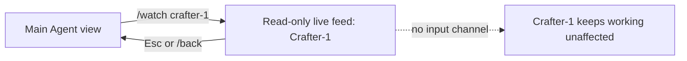

# FLOW — System Mechanics & State Machine

This document covers the actual mechanics: how the Ledger works, how phases get built and executed, how unplanned discoveries are handled, and where the approval gates sit. See `prd.md` for the why, `todo.md` for implementation tracking.

## 1. End-to-End Flow



## 2. The Ledger

The Ledger is owned exclusively by Main Agent. It's the single source of truth for file state, and it doubles as the data the final report is generated from — there's no separate "reporting" step, Main Agent just walks the Ledger at the end.

### 2.1 Structure

```json
{
  "currentPhase": 2,
  "totalPhases": 3,
  "files": {
    "lib/api.js": {
      "status": "done",
      "phase": 1,
      "owner": "crafter-1",
      "summary": "updated response parsing for new BE format"
    },
    "dashboard.js": {
      "status": "in_progress",
      "phase": 2,
      "owner": "crafter-2"
    },
    "settings.js": {
      "status": "pending",
      "phase": 2,
      "owner": null
    }
  }
}
```

### 2.2 File Status Lifecycle



A file can only move to `in_progress` if its phase's gate is open (i.e., all prior phases are fully `done`). This is the mechanism that prevents two Crafters from touching files with an unresolved dependency between them.

## 3. Dependency Graph → Phases

This is the part that justifies the "slower is faster" tradeoff — Scout does real AST parsing (not just grep) before Main Agent commits to a plan, because misjudging a dependency here means discovering a conflict mid-execution instead of on paper.

### 3.1 Example

Task: "Update BE response format — affects API layer and dashboard."

Scout returns:

```json
{
  "graph": {
    "lib/api.js": { "exports": ["fetchDashboard", "fetchSettings"], "importedBy": ["dashboard.js", "settings.js"] },
    "dashboard.js": { "imports": ["lib/api.js"], "importedBy": [] },
    "settings.js": { "imports": ["lib/api.js"], "importedBy": [] }
  }
}
```

Main Agent topologically sorts this into phases:



`dashboard.js` and `settings.js` both depend on `lib/api.js`, but not on each other — so they land in the same phase and run in parallel safely. This is the general rule: **same phase = parallel-safe by construction**, because anything with a dependency relationship is forced into different phases by the topological sort.

### 3.2 Dependency installs as Phase 0

When a task requires new dependencies, that becomes its own early phase — every other Crafter in later phases waits, since nothing should start using a package before it's actually installed.



## 4. Unplanned Discovery — The "Surveyor and the Builder" Model

Scout's dependency graph is built from static analysis and can miss things — dynamic imports, string-based requires, things genuinely hidden until an agent is in the file with hands on the code. The analogy: a surveyor can map a plot of land perfectly and still miss a rock buried under the soil. The builder finds it the moment they start digging.

**Decision: trust the agent that found it. Don't re-dispatch Scout to confirm.** Re-scanning to verify something the Crafter already directly observed is a redundant round-trip — the field report is already better information than what Scout could re-derive from a distance.

### 4.1 The "richer report" mechanism

The one refinement on top of pure trust: when Crafter reports an unplanned file, it includes not just the file itself but what *that file* imports too — a one-hop lookahead. This costs nothing extra (Crafter already has the file open to know it's relevant), but gives Main Agent enough information to catch a second-order conflict before it happens, rather than finding out about it three minutes later from a different agent.



### 4.2 Why re-read after waiting, even with trust

If Crafter had to wait because another agent was mid-edit on a related file, it must **re-read the file's current state before proceeding** — never assume the old read is still valid. The other agent's change might have already covered what Crafter needed, or changed the surrounding context enough that the original plan needs adjusting.

## 5. Approval Gates

There are exactly two points where the system always stops for a human decision, regardless of trust mode:

1. **Plan approval** (before any execution starts) — paired with the trust-mode question, asked per task.
2. **Out-of-scope test failures** — if Gatekeeper finds a failure in a file nobody on the task touched or planned to touch, Main Agent always asks: was this already broken, or did we cause it? Trust mode does not override this gate, because auto-deciding scope creep is a different risk category than auto-fixing something already in plan.

Everything else (in-scope fixes, phase transitions, unplanned-but-related file additions) is governed by trust mode as described in `prd.md` §5.1.

## 6. Watch Mode Mechanics



Watching never pauses or redirects the agent being watched. If the user wants to change something, they return to Main Agent and issue the instruction there — Main Agent is the only thing permitted to write to the Ledger or alter a running plan.

## 7. Summary Table — Who Can Do What, When

| Action | Trust mode (🙈) | Checkpoint mode (🔍) |
|---|---|---|
| Plan approval | Required | Required |
| Phase transition | Silent | Brief notification |
| Unplanned file discovery (no conflict) | Auto-proceed, logged | Ask before proceeding |
| Unplanned file discovery (conflict, must wait) | Auto-wait, logged | Ask before proceeding |
| In-scope test failure | Auto-fix + re-test | Ask before fixing |
| Out-of-scope test failure | **Always ask** | **Always ask** |
| Final report | Always shown | Always shown |