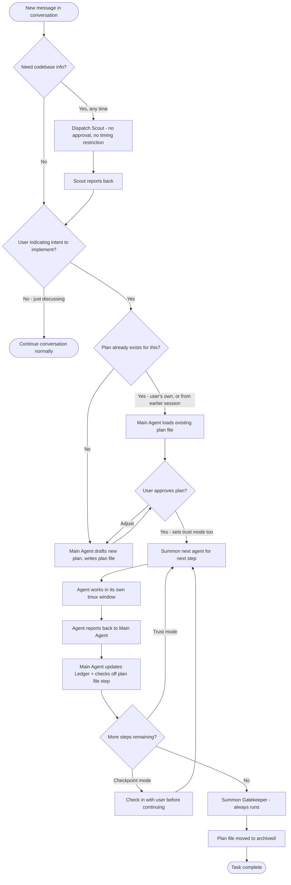
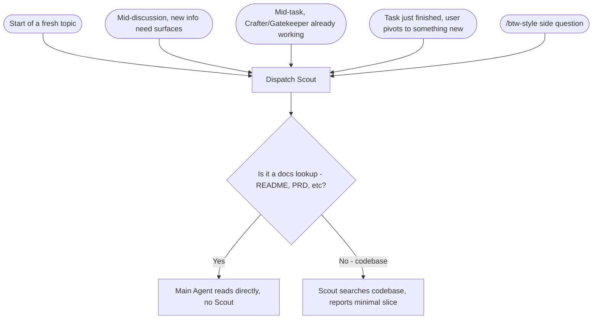
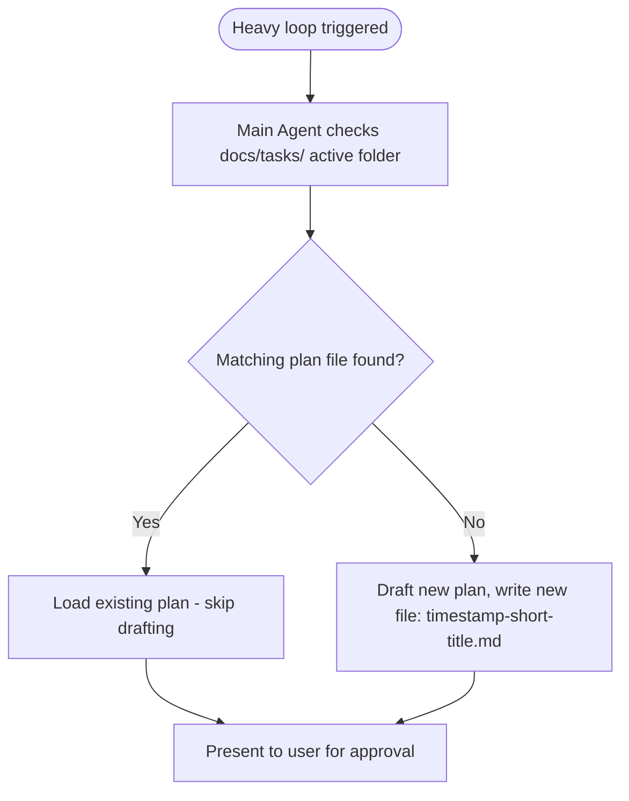
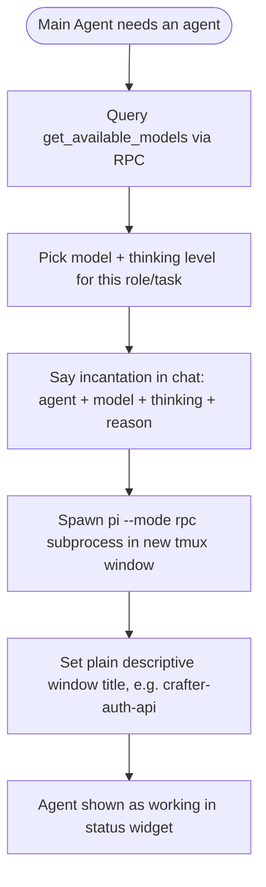
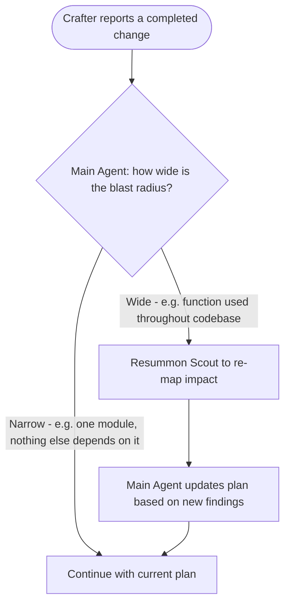
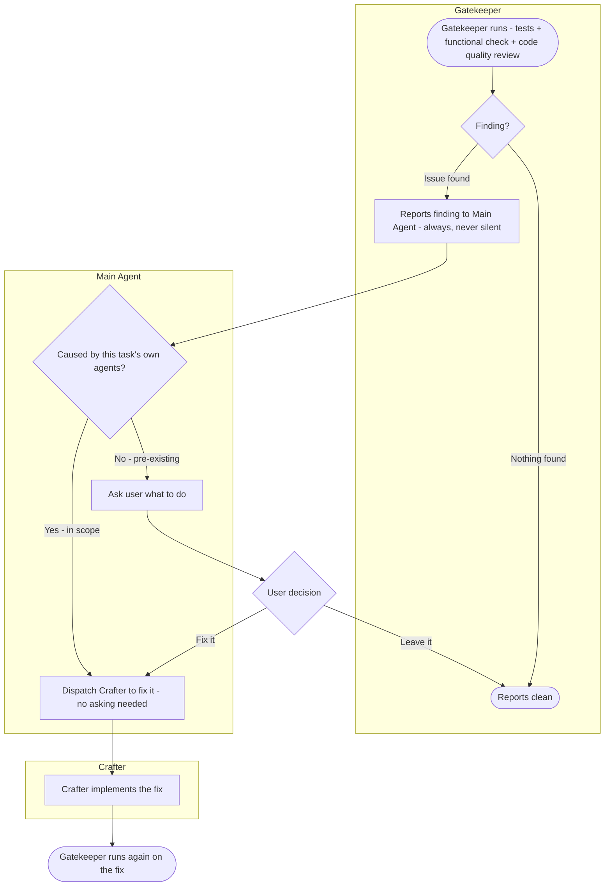
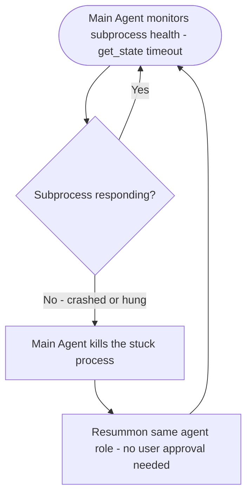

# /summoner — Flow

> Adapted from the standard Flow template: `/summoner` has no pages or navigation in the usual sense — it's a CLI extension orchestrating subprocesses. "Page list" and "navigation structure" are replaced below with the equivalent for this kind of system: a surface list (what the user actually sees/interacts with) and the overall process flow. Each subsequent section is a Mermaid diagram of one significant flow, same as a normal Flow doc.

## Surfaces

What the user actually sees or touches, in place of a page list.

| Surface | Where | Purpose |
|---|---|---|
| Main Agent conversation | tmux window 0 | Primary interface — task input, plan presentation, approvals, incantations, status widget |
| Status widget | Top of window 0, alongside Main Agent | At-a-glance view of all active/queued/done agents |
| Sub-agent tmux window | `crafter-*`, `scout-*`, `gatekeeper-*` windows | Live, read-only view of one agent's actual work (via `/watch`) |
| Plan file | `docs/tasks/{timestamp}-{title}.md` | Persisted checklist, glanceable outside the chat entirely; moves to `archived/` on completion |

## Overall process flow (v3 — ambient triggering)

No single `Start` node anymore — Main Agent is continuously evaluating every conversation turn against two independent triggers. `/summoner <task>` still exists as a manual override that jumps straight to the "draft/load plan" step, bypassing the ambient check.



## Flow: Scout's ambient trigger

Scout's trigger has no timing restriction — this can fire at any point shown below, independent of whatever else is happening (including mid-Crafter-work).



## Flow: Plan file existence check

Triggered whenever the heavy loop is about to start (ambiently or via `/summoner`), before Main Agent decides whether to draft a new plan.



## Flow: Summoning a sub-agent (the incantation)

Triggered any time Main Agent decides to dispatch Scout, Crafter, or Gatekeeper.



## Flow: Mid-task impact check (Scout re-summon)

Triggered when Crafter reports a change back to Main Agent.



This is a judgment call made fresh each time, not a fixed rule — see PRD.

## Flow: Gatekeeper review and fix

Triggered after Crafter's work is reported as done, before the task is considered complete. Gatekeeper never edits files — every fix flows back through Crafter.



## Flow: Subprocess crash recovery

Triggered any time during an active summon — relevant specifically because trust mode means the user may not be watching.



## Wireframe-level notes

- Status widget format (from PRD), always visible in window 0:
  ```
  🟢 crafter-1   dashboard.js   (working)
  🟡 crafter-2   waiting (phase gate)
  ✅ crafter-3   settings.js    (done)
  ```
- tmux window naming: `{role}-{short-description}`, incrementing on re-summon to the same area (`crafter-auth-api`, then `crafter-auth-api-2`).
- `/watch <agent-name>` = `tmux select-window` to that agent's window. `Esc` / `/back` returns to window 0. Watching is always read-only — no input channel to the sub-agent from the watch view.